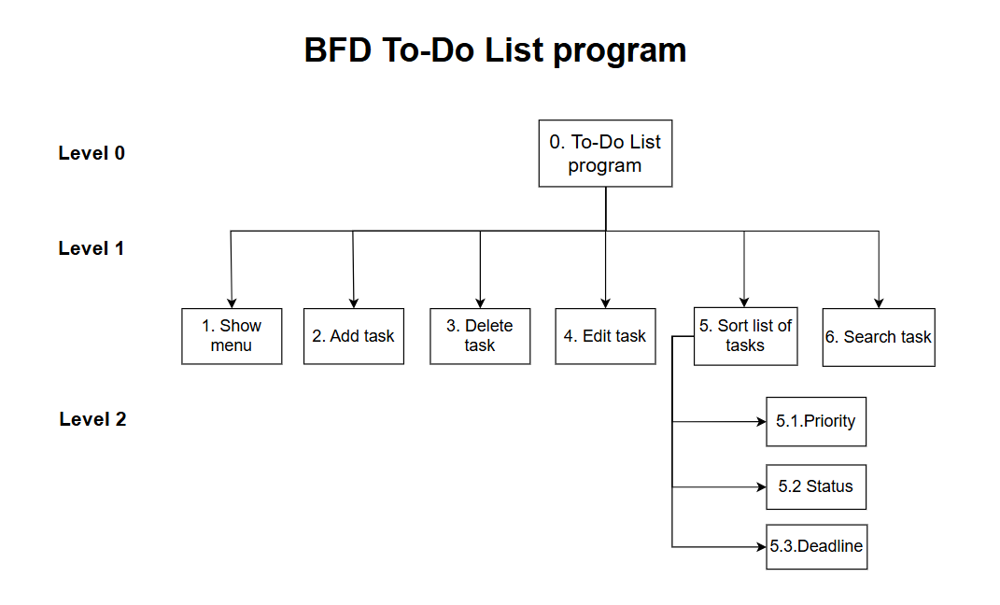

# TODOLIST PROGRAM

## 1. Overview

- Objective: Ceate an app for managing tasks easily on CLI
- Functions:
    - Add task
    - Delete task
    - Edit task
    - Search tasks by names
    - Sort tasks list by completion rate
- Goal: An user-friendly and minimal app with basic functions.


## 2. Features

- Add task: You can create new task by entering name and completion rate.
- Delete task: Delete exiting task by entering ID.
- Edit task: Edit task’s name and completion rate.
- Search task: Search task by name.
- Sort tasks: Sort tasks by completion rate and display table of tasks.




## 3. Getting Started

### 3.1. Prerequisites

You will need following tools for running To-do list:

- OS: Ubuntu (Tested successfully on version 24.04.2 LTS)
- git (Tested successfully on version 2.43.0)
- GCC (Tested successfully on version 13.3.0)

You can check if your computer has `git` and `GCC` by using:

```sh
git --version
gcc --version
```

Install them by using:

```sh
sudo apt install git build-essential -y
```

### 3.2. Quick Start

If

Step 1: Clone the repository: 
    ```sh
    git clone https://github.com/UVM10/ToDoList.git
    ```
Step 2: Setup
- Move to ToDoList directory:
    ```sh
    cd ToDoList
    ```
- Allow using all scripts: 
    ```sh
    chmod +x ./utils/build.sh ./utils/clean.sh ./utils/run.sh
    ```    
Step 3: How to run the app
- Build program:
    ```sh
    ./utils/build.sh
    ```    
- Run program:
    ```sh
    ./utils/run.sh
    ```
- Clean up files generated:
        
    ```sh
    ./utils/clean.sh
    ```
